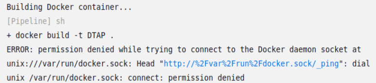
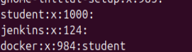
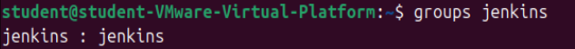

Vul onderstaande aan met de antwoorden op de vragen uit de readme.md file. Wil je de oplossingen file van opmaak voorzien? Gebruik dan [deze link](https://github.com/adam-p/markdown-here/wiki/Markdown-Cheatsheet) om informatie te krijgen over
opmaak met Markdown.

### a) RECHTEN GEVEN AAN JENKINS
Nadat we het 'docker build'-commando voor de eerste keer hadden geprobeerd te runnen in de pipeline, kregen we onderstaande ERROR te zien in de Console Output:

Hierna hebben we de volgende commando's uitgevoerd om te zien of er een groep bestaat voor Docker en of onze Jenkinsgebruiker tot deze groep behoort:

`cat /etc/group`

`groups jenkins`

Nu dat we weten dat onze Jenkinsgebruiker niet tot deze groep behoort, kunnen we hem hieraan toevoegen zodat hij de rechten krijgt om Docker te gebruiken. Dit doen we door het commando '`sudo usermod -aG docker jenkins`' uit te voeren en vervolgens de VM opnieuw op te starten.

Nu dat Jenkins succesvol aan deze groep is toegevoegd kunnen we het 'docker build'-commando opnieuw proberen uitvoeren, wat dit keer zal leiden tot een succes.
